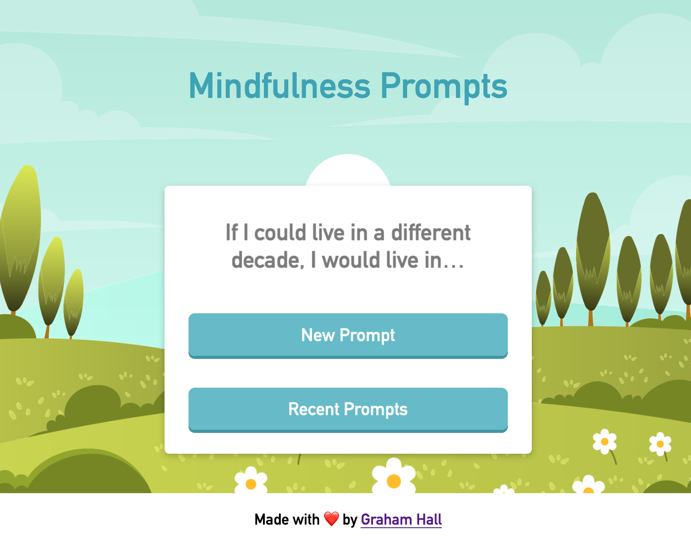

# Mindfulness Journal Prompts

## Table of Contents

- [Description](#description)
  - [User Story](#user-story)
  - [Features](#features)
  - [Screenshot](#screenshot)
- [Future Developments](#future-developments)
- [Installation](#installation)
- [Usage](#usage)
- [Dependencies](#dependencies)

## Description

### User Story

As a user I'd like an app that will generate a random prompt for journaling. I'd also like to view a history of generated prompts that is persistent between sessions. When I'm on the home page I'm presented with a prompt, as well as a button to generate a new prompt if I choose. Finally, I'd like a button that will bring up a list of all the prompts the page has generated for me.

### Features

- On page load the user is presented with a random journal prompt from a list of almost 400 possible choices
- The user can click a button to instantly get a new prompt
- Every prompt the user receives is kept in local storage
- The user can click a button to retrieve and view all previous prompts

### Screenshot

## Future Developments

- Move prompts into a database, and allow users to add their own prompts.

## Installation

- Install node if you don't already have it
- Clone this repo
- Navigate to the repo's location on your computer in your terminal
- Run the `npm install` command and wait for the process to finish
- Run `npm start` and navigate to `localhost:3000` in your web browser

## Usage

- Visit https://mindfulness-prompts.herokuapp.com, or `localhost:3000` if running locally
- Click `Generate New Prompt` to display a new prompt
- Click `Previous Prompts` to see a history of prompts you've seen

## Dependencies

- [React](https://reactjs.org)
- [react-modal](https://www.npmjs.com/package/react-modal)
- [FontAwesome](https://fontawesome.com/)
